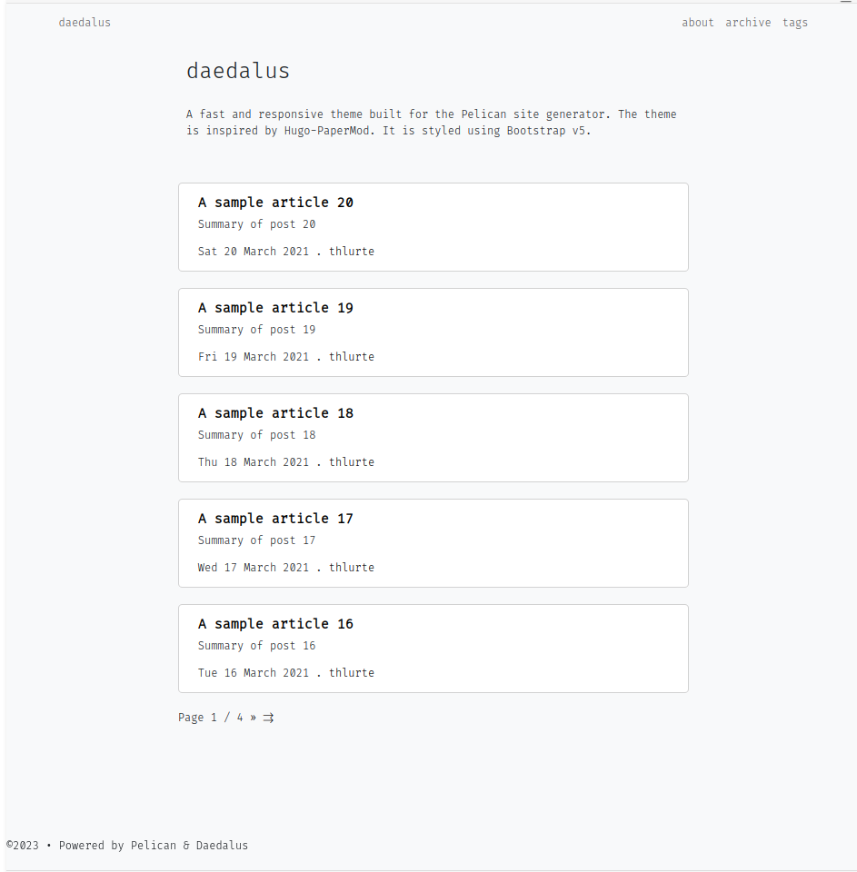

# daedalus

i know he looks awfull for now, but he'll go through one hell of a changes over time.



### Settings
This is the pelicanconf.py settings file for the demo site, please change values to meet your needs.
```python

AUTHOR = 'Author'
SITENAME = 'daedalus'
SITEURL = ''

PATH = 'content'

TIMEZONE = 'Asia/Colombo'

DEFAULT_LANG = 'en'
THEME = "/home/ahmed/lab/daedalus/themes/notsimple" # will change the name soon
# Feed generation is usually not desired when developing
FEED_ALL_ATOM = None
CATEGORY_FEED_ATOM = None
TRANSLATION_FEED_ATOM = None
AUTHOR_FEED_ATOM = None
AUTHOR_FEED_RSS = None

# Blogroll
LINKS = (('Pelican', 'https://getpelican.com/'),
         ('Python.org', 'https://www.python.org/'),
         ('Jinja2', 'https://palletsprojects.com/p/jinja/'),
         ('You can modify those links in your config file', '#'),)

# Social widget
SOCIAL = (('You can add links in your config file', '#'),
          ('Another social link', '#'),)

DEFAULT_PAGINATION = 5

MENUITEMS = [
             ("about","about.html"),
             ("archive","archive.html"),
             ("tags","tags.html")]

DISPLAY_CATEGORIES_ON_MENU = False
DISPLAY_PAGES_ON_MENU = False
# Uncomment following line if you want document-relative URLs when developing
#RELATIVE_URLS = True


```
### General Articles

A sample article header is below. Adding a `Summary` field is highly recommended. It substitutes as the article decription and gets added into html `<meta name="description" content="...">`. Summaries are also used in blog's home page. They help to keep similar height article previews without titles, images or code blocks.

```markdown
Title: Installation
Date: 2021-12-14
Tags: CSS, Markdown, Python, AI
Category: Software
Summary: Lorem ipsum dolor sit amet, consectetuer adipiscing elit. Nullam dignissim convallis est. Quisque aliquam. Donec faucibus. Nunc iaculis suscipit dui. Nam sit amet sem. Aliquam libero nisi, imperdiet at, tincidunt nec, gravida vehicula, nisl.

```

Articles created inside directory named pages will have a separate static page and a direct link similar to the `About` page in the demo.

You can now run the development server and visit the `http://localhost:8000`

```bash
cd myBlog
$ pelican --autoreload --listen --ignore-cache
```

Final project directory structure should look similar to this.

```
$ (pelican) ➜ daedalus tree
├── myBlog
│   ├── content
│   │   ├── images
│   │   │   └── camera.png
│   │   ├── pages
│   │   │   ├── about.md
│   │   │   └── events.md
│   │   ├── Hardware
│   │   │   ├── article-one.md
│   │   │   └── article-two.md
│   │   └── Software
│   │       ├── article-three.md
│   │       └── article-four.md
│   ├── Makefile
│   ├── output
│   │
│   ├── pelicanconf.py
│   ├── pelican-plugins
│   │   └── pelican-toc
│   │
│   ├── publishconf.py
│   ├── tasks.py
│   └── themes
│       └── daedalus
└── venv

```

### Image size and placement

Images can be placed on page by adding a custom class names such as `image-left`, `image-right`, `image-center` in your markdown.

Similarly, placed images can be given a size using custom classes `image-thumbnail`, `image-small`, `image-medium` and `image-large`.

You can use `` tags along with the custom image classes straight in your Markdown.

```html


Alternatively you could use inline styling.

```

### Embeding YouTube Videos

In order to have a responsiveness video tumbnail, the `<iframe>` tags must be wrapped inside the`<div class="aspect-w-16 aspect-h-9"></div>` in your markdown file.
```html
<div class="aspect-w-16 aspect-h-9">
    <iframe width="736" height="414" src="https://www.youtube.com/embed/TmWIrBPE6Bc" title="YouTube video player" frameborder="0" allow="accelerometer; autoplay; clipboard-write; encrypted-media; gyroscope; picture-in-picture" allowfullscreen>
    </iframe>
</div>
```

